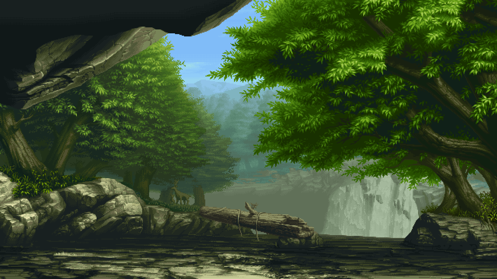
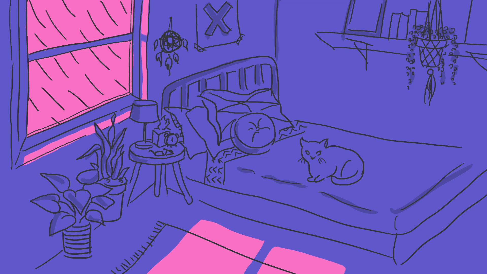
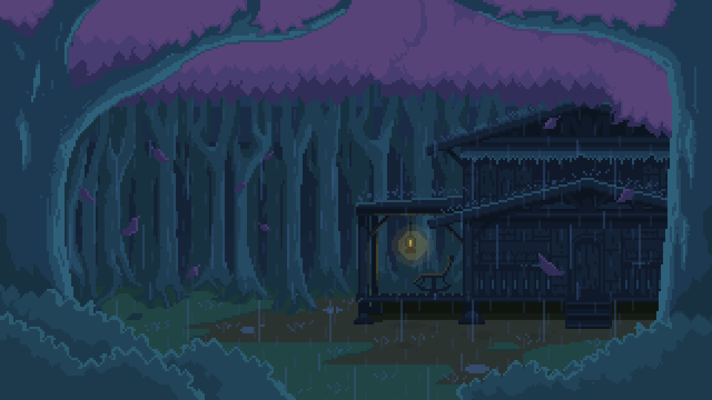
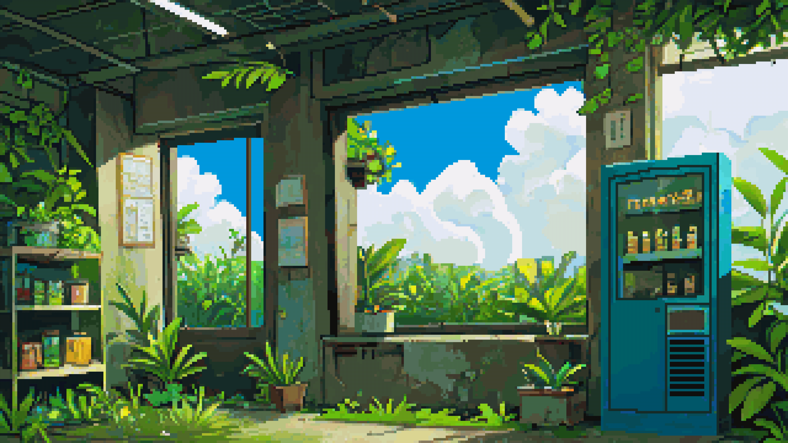
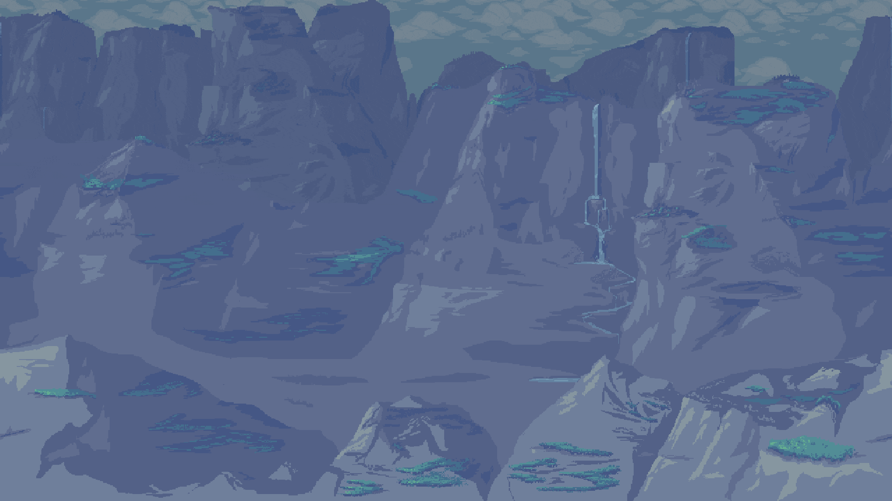
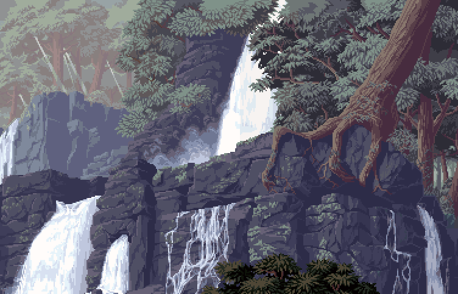

# Papes
Repo of animated wallpapers i found using a search engine

# Using with swww and hyprland on NixOS

```nix
# flake.nix
inputs = {
  papes = {
    url = "github:BatteredBunny/papes";
    flake = false;
  };
}
```

```nix
# home.nix
wayland.windowManager.hyprland = {
  settings.exec-once = [
    "swww img $(find ${inputs.papes}/images | shuf -n1)" # Display random wallpaper from wallpapers
  ];
};
```

<!-- WALLPAPER_GALLERY -->
# Wallpaper Gallery
| | | 
|---|---|
|  |  |
|  |  |
|  |  |
|  |  |
|  |  |
|  |  |
|  |  |
|  |  |
|  |  |
<!-- END_WALLPAPER_GALLERY -->
